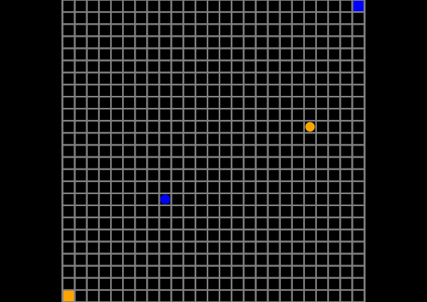

# GridGoalMDPs

For now this only has one two-agent MDP.



To solve and make a gif like the one above, `cd` to the directory of this project and in julia run

```
(v1.1) pkg> activate .

(GridGoalMDPs) pkg> instantiate

julia> include("scripts/makegif.jl")
```

(to get to the `pkg` prompt, use `]`.)
